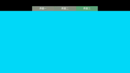

RadioGroup结合ViewPager实现标题栏和界面滑动切换
---
- [参考网址](https://my.oschina.net/qibin/blog/316650)
- 效果图如下：

- 
- 注意事项， 在布局中的RadioButton的图片选择器selector必须是一样的;
示例布局如下
```
<RelativeLayout xmlns:android="http://schemas.android.com/apk/res/android"
                android:layout_width="match_parent"
                android:layout_height="match_parent"
                android:layout_gravity="center"
                android:background="@android:color/black">

    <RadioGroup
        android:id="@+id/radio_group"
        android:layout_width="match_parent"
        android:layout_height="wrap_content"
        android:layout_marginTop="@dimen/margin_huge"
        android:gravity="center_horizontal"
        android:orientation="horizontal">

        <RadioButton
            android:id="@+id/menu_one_button"
            android:layout_width="wrap_content"
            android:layout_height="wrap_content"
            android:background="@drawable/radio_btn_selector"
            android:button="@null"
            android:ellipsize="end"
            android:gravity="center"
            android:maxLines="1"
            android:text="@string/menu_one"
            android:textColor="@android:color/white"
            android:textSize="@dimen/text_size_small"/>

        <RadioButton
            android:id="@+id/menu_two_button"
            android:layout_width="wrap_content"
            android:layout_height="wrap_content"
            android:layout_toRightOf="@+id/menu_one_button"
            android:background="@drawable/radio_btn_selector"
            android:button="@null"
            android:ellipsize="end"
            android:gravity="center"
            android:maxLines="1"
            android:text="@string/menu_two"
            android:textColor="@android:color/white"
            android:textSize="@dimen/text_size_small"/>

        <RadioButton
            android:id="@+id/menu_three_button"
            android:layout_width="wrap_content"
            android:layout_height="wrap_content"
            android:layout_toRightOf="@+id/menu_two_button"
            android:background="@drawable/radio_btn_selector"
            android:button="@null"
            android:ellipsize="end"
            android:gravity="center"
            android:maxLines="1"
            android:text="@string/menu_three"
            android:textColor="@android:color/white"
            android:textSize="@dimen/text_size_small"/>

    </RadioGroup>

    <view
        android:id="@+id/viewpager"
        class="android.support.v4.view.ViewPager"
        android:layout_width="match_parent"
        android:layout_height="match_parent"
        android:layout_below="@+id/radio_group"
        android:overScrollMode="never"/>

</RelativeLayout>
```
- 具体使用参考代码MainActivity
